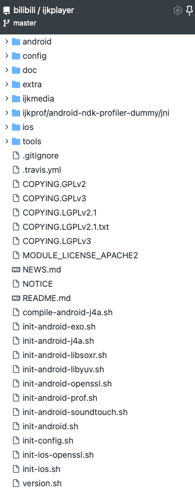

#【一撸到底--ijkplayer】1.ijkplayer项目目录说明
___
## 描述
jkplayer是b站开源的视频播放器，是一个基于FFmpeg的轻量级Android/iOS视频播放器。支持播放本地网络视频，也支持流媒体播放

FFmpeg的是全球领先的多媒体框架，能够解码，编码， 转码，复用，解复用，流，过滤器和播放大部分的视频格式。
它提供了录制、转换以及流化音视频的完整解决方案。
它包含了非常先进的音频/视频编解码库libavcodec，为了保证高可移植性和编解码质量，libavcodec里很多code都是从头开发的。

## 目录

  

存放在ijkplayer目录里面  
├── build.gradle  
├── gradle  
├── gradle.properties  
├── gradlew  
├── gradlew.bat  
├── ijkplayer-arm64    
├── ijkplayer-armv5  
├── ijkplayer-armv7a  
├── ijkplayer-example  
├── ijkplayer-exo  
├── ijkplayer-java  
├── ijkplayer-x86  
├── ijkplayer-x86_64  
├── settings.gradle  
└── tools  

